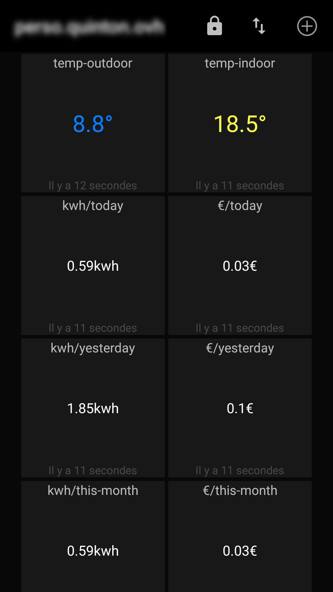

# viessmann-mqtt

this application is an MQTT gateway for Viessmann heaters mainly writen in Ruby language :
* that is connected to heater with an USB-TTL adaptator
* vitalk daemon handle serial IO to Viessman heater, based on P300 protocol
* we use a modified version of vitalk daemon supporting raw read and write commands
* an MQTT server is used to handle IO from vitalk and Internet dashboard
* an sqlite database is used to store heating power, in percent, every minutes

Work-in-progress
* description of [adresses](https://github.com/mqu/viessmann-mqtt/blob/master/docs/viessmann-addresses.ods?raw=true) in an [.YAML](https://github.com/mqu/viessmann-mqtt/blob/master/src/wip/device-20CB.yaml) file
* extend API to support those files.

## Dashboards
### Android MQTT Dashboard application

### Cayenne dashboard

## install

    sudo apt-get install ruby ruby-sqlite3 mosquitto mosquitto-clients
    sudo gem install mqtt
    
    # add user to dialout group
    sudo usermod -aG dialout $(whoami)
    
    sudo mosquitto_passwd -c /etc/mosquitto/passwd user
    
    cat >> /etc/mosquitto/mosquitto.conf << EOF
    allow_anonymous false
    password_file /etc/mosquitto/passwd
    
    EOF
    service mosquitto restart
    
    cd $HOME
    git clone https://github.com/mqu/viessmann-mqtt/
    cd viessmann-mqtt

## usage

all operations are done with viessmann-mqtt bash script wrapper :
    
    # install packages : ruby, sqlite, gems
    ./viessmann-mqtt sys-install
    
    # download and install vitalk (not mandatory if running on raspbian : vitalk binary is given in package)
    ./viessmann-mqtt install
    
    # create mandatory directories and database
    ./viessmann-mqtt init
    
    # start, stop, restart and status
    viessmann-mqtt start
    viessmann-mqtt status
    viessmann-mqtt stop
    viessmann-mqtt restart

## configuration

* all parameters are centralised in etc/viessmann-mqtt.yaml ; 
* if you plan to commit some change, you may copy this file to $HOME/.config to avoid publish your private passords.
* this application can be installed in your HOME directory or any place under your drive : it will try to work and locate scripts and libraries.

## software architecture

* 1 : `viessmann-mqtt-gateway.rb` handle IO from vitalk and publish data to MQTT software bus
* 2 : `viessmann-mqtt-sub.rb` handle publish to MQTT server and send commands to vitalk and heater
* 3 : `viessmann-power-sqlite.rb` store power heater every minutes in sqlite database
* 4 : `viessmann-mqtt-sub-cayenne-gw.rb` receive publish commands
* 5 : requests from Internet clients (Cayenne, Mqtt-Dashboard or any)

misc :

* some time, USB device get disconnected from linux kernel : `monitor-usb-device.rb` will monitor thoses disconnections and restart every tasks with `viessmann-mqtt` bash script wrapper.

## TODO

* complete raw-read wrapper (`src/extra/viessmann-tcpclient-raw.rb`)
* experiment Wireless interface based on ESP8266
* grafana + influxdb monitoring

## links
* vitalk : https://github.com/mqu/vitalk : english port and raw read and put
* rvitalk : my first P300 protocol implementation in Ruby (buggy) : https://gist.github.com/mqu/9519e39ccc474f111ffb
* Viessmann open-source community : http://openv.wikispaces.com/ with :
  * Optolink TTL-USB interface : http://openv.wikispaces.com/Bauanleitung+3.3V+TTL 
  * Wireless interface : http://openv.wikispaces.com/Bauanleitung+ESP8266 

