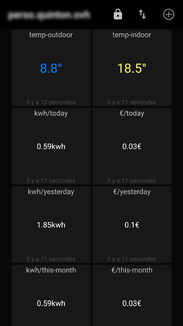

# viessmann-mqtt

this application is an MQTT gateway for Viessmann heaters :
* is connected to heater with an USB-TTL adaptator
* a modified version of vitalk is used (https://github.com/mqu/vitalk) translated into english with some enhancements
* 

